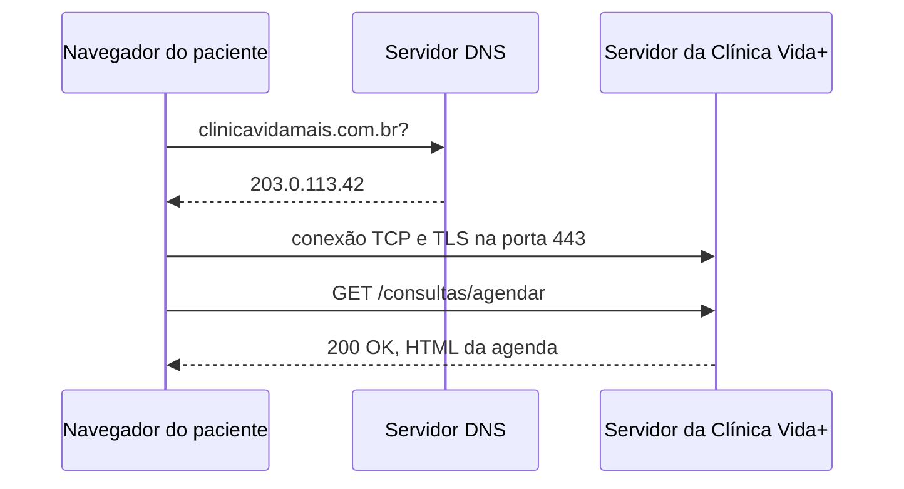

## O caminho de uma requisição

```mermaid
sequenceDiagram
    participant N as Navegador do paciente
    participant D as Servidor DNS
    participant S as Servidor da Clínica Vida+
    N->>D: clinicavidamais.com.br?
    D-->>N: 203.0.113.42
    N->>S: conexão TCP e TLS na porta 443
    N->>S: GET /consultas/agendar
    S-->>N: 200 OK, HTML da agenda
```
